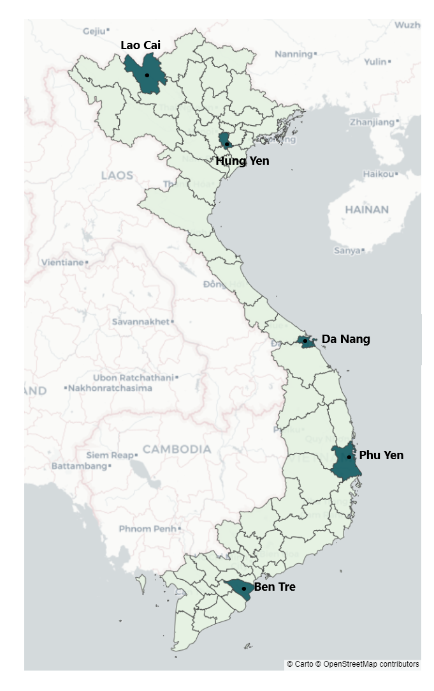

# The effect of home and school inputs on learning achievement in Vietnam: A fixed-effects approach

<a href="https://nbviewer.org/github/non-ceterisparibus/learning-achievement-YLS/blob/main/Notebook.ipynb"
   target="_parent">
   

## Abstract

> Given the recent tremendous expansion of the public educational system in Vietnam with remarkable performance such as nearly universal primary school enrolment and high scores in international standardized tests, this paper concerns the learning gaps between children from more and less advantaged backgrounds and the unequal distribution of education in Vietnam. This analysis provides the overall picture of the factors behind the achievement differences by exploiting within-child variation in longitudinal Young Live study data. The rich information of family and school input enables many estimation specifications that accommodate the presence of unobserved endowments and input choices that are endogenous concerning endowed mental capacity. The study finds that mothers' ability,  improvement of access to service, and investing in learning supporting devices at home and school positively impact the achievement of unprivileged students. The paper further discusses other constraints for the country - most of which were identified decades ago but have not been appropriately tackled- such as dropout rate in secondary level and private tutoring.

This paper contributes to the studying of child’s cognitive accumulation in developing countries in two ways : (i) I extend the definition of investment for a child to time investment. (ii) In contrast with other papers using class size or teacher salary as a proxy for school input, I construct the school inputs at a comparable level with home inputs and use within-child variation to distinguish the effect of family and schooling system on child’s test outcomes.

## Folder Content
    * YLdata_homeinput  : data processing for home input variables
    * YLdata_schinputs  : data processing for school input variables
    * YLdata_testcore   : testscore and education history
    * YLdata_paneldesc  : data description
    * Summary_stat      : Statistic summary tables for home inputs and school inputs 
    * YLdata_childFE    : Fixed-effects model
    * Notebook          : Short version of the paper